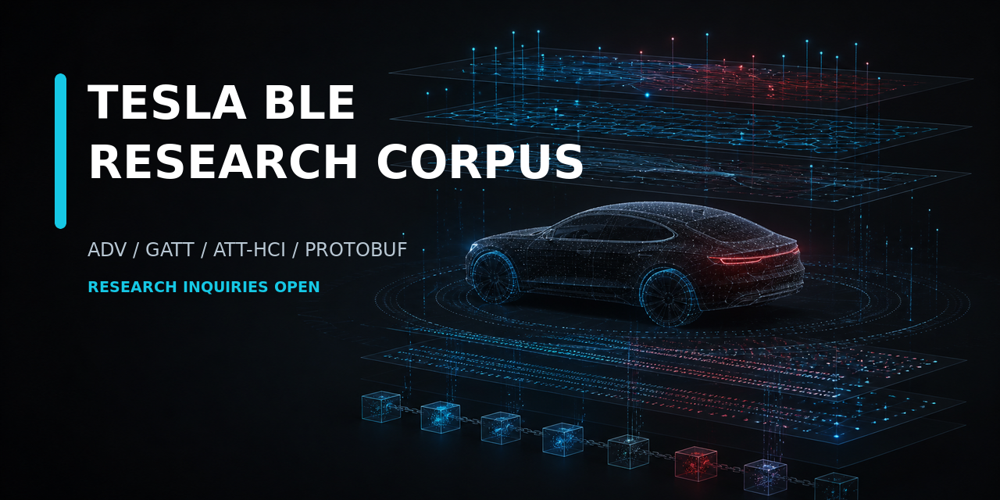

# Tesla BLE Research Corpus

Independent, evidence-grade research index for a private Tesla Bluetooth Low
Energy corpus, parser validation, and reproducible multi-layer analysis.

> **Research inquiries are open.** Email
> [teslable.research@gmail.com](mailto:teslable.research@gmail.com) or open a
> [research-interest issue](../../issues/new?template=research-interest.yml).
>
> This public repository contains no raw corpus, vehicle list, capture archive,
> or private laboratory path.

## What exists

The private research library covers **2,048 field-observed Teslas**. GATT cases
were collected while the corresponding vehicle was being observed in the
field. A selected **10-case Deep Evidence Pilot** is being prepared for
technical evaluation: nine vehicle cases with HCI evidence and one rare Tesla
Keyfob case with Android/nRF Connect GATT evidence but no matching HCI capture.

The ten cases are intentionally not artificial clones of one another. Evidence
depth varies by case:

- one case may contain a single GATT session while another contains about 70;
- ADV and Android ScanRecord material may be present;
- HCI/ATT evidence is included where it was captured;
- some cases include field observations, TPMS material, or longitudinal data;
- one rare Tesla Keyfob case includes Android/nRF Connect GATT evidence but no
  matching HCI capture;
- every missing layer is recorded as missing rather than silently substituted.

The common standard is not identical content. It is explicit provenance,
source separation, byte-level integrity, and an honest account of what each
case can and cannot establish.

## Evidence layers

Depending on the case, the private library may contain:

- BLE advertising and Android ScanRecord observations;
- original GATT session exports and service discovery;
- ATT/HCI captures or source-bound target slices;
- characteristic `0x0212` writes and `0x0213` value streams;
- length-aware `0x0213` message parsing;
- protobuf wire trees and unresolved-field ledgers;
- MTU, connection, CCCD, error, and disconnect timelines;
- TPMS or Keyfob material;
- field observations kept separate from protocol facts;
- source maps, SHA-256 manifests, duplicate maps, and explicit gaps;
- local-server and emulation evidence kept in separate test layers.

## Internal analysis toolchain

The private toolchain supports:

- source-aware GATT and HCI extraction;
- session-bounded `0x0213` extraction and message counting;
- ATT opcode and application-label correlation;
- protobuf wire decoding without invented field semantics;
- payload extraction, transition analysis, and cross-case queries;
- duplicate, contamination, local-server, and emulation quarantine;
- reproducible manifests and validation of retained artifacts.

The toolchain can also be adapted to a research partner's exact input formats,
questions, and expected outputs.

## Selected research value

The corpus has already produced cases useful for regression and protocol
analysis, including:

- a wire-level distinction between ATT indications and notifications despite
  an unchanged application label;
- longitudinal changes in a Tesla GATT characteristic declaration;
- a rare Tesla Keyfob GATT case with successful connection, MTU negotiation,
  Tesla service discovery, readable device identity, and documented negative
  bonding and timeout behavior;
- population-scale anomalies retained with counterexamples and an explicit
  `UNKNOWN` mechanism where causality is not established.

## Research and evaluation tracks

The final product format has deliberately not been fixed. Current evaluation
tracks are:

1. **Tesla BLE Deep Evidence Pilot** — ten selected multi-layer cases.
2. **Parser and Decoder Validation Pack** — raw evidence, fixtures, expected
   outputs, edge cases, and negative cases.
3. **Anomaly Evidence Dossier** — one narrowly scoped finding with supporting
   evidence, counterexamples, and unresolved questions.
4. **Private Corpus Query** — a research question tested against the private
   corpus without transferring the entire library.
5. **Custom Research Integration** — tooling or analysis adapted to a partner's
   workflow.

See [Engagement models](docs/ENGAGEMENT.md) for the questions this project is
currently asking potential users.

## Full fidelity and controlled access

No raw Tesla data is published in this repository.

For a qualified research engagement, an agreed evidence package can be
transferred through a controlled channel in its original byte-level form when
full fidelity is required for reproducibility. Scope, included layers, delivery
format, and permitted use are established for each engagement.

There is no immediate public download or self-service purchase. Evaluation and
future licensing are handled by inquiry.

## Who this is for

The project is looking for technically specific feedback from:

- Bluetooth protocol-analyzer and decoder developers;
- automotive-security and digital-forensics laboratories;
- BLE and GATT/ATT researchers;
- parser, regression, and test-tool developers;
- automotive technical-intelligence teams;
- researchers who need real-world multi-case evidence rather than one
  laboratory device.

If this material could solve a real problem in your work, open a
[research-interest issue](../../issues/new?template=research-interest.yml).
Please describe the use case, required evidence layers, preferred formats, and
the result you would need from an evaluation.

Private research and commercial inquiries:
[teslable.research@gmail.com](mailto:teslable.research@gmail.com)

## Documentation

- [Corpus design](docs/CORPUS.md)
- [Evidence model](docs/EVIDENCE_MODEL.md)
- [Analysis capabilities](docs/CAPABILITIES.md)
- [Engagement models](docs/ENGAGEMENT.md)
- [Contribution and disclosure boundaries](CONTRIBUTING.md)

## Evidence discipline

Every material conclusion is classified as one of:

- `FACT`
- `INFERENCE`
- `HYPOTHESIS`
- `UNKNOWN`

Application, GATT, ATT/HCI, radio, field-observation, and emulation layers are
kept separate. A hash proves retained-artifact integrity; it does not by itself
prove source completeness, vehicle identity, or physical causality.

## Independence

This is an independent research project. It is not affiliated with, sponsored
by, or endorsed by Tesla, Inc. Tesla is a trademark of its respective owner.
